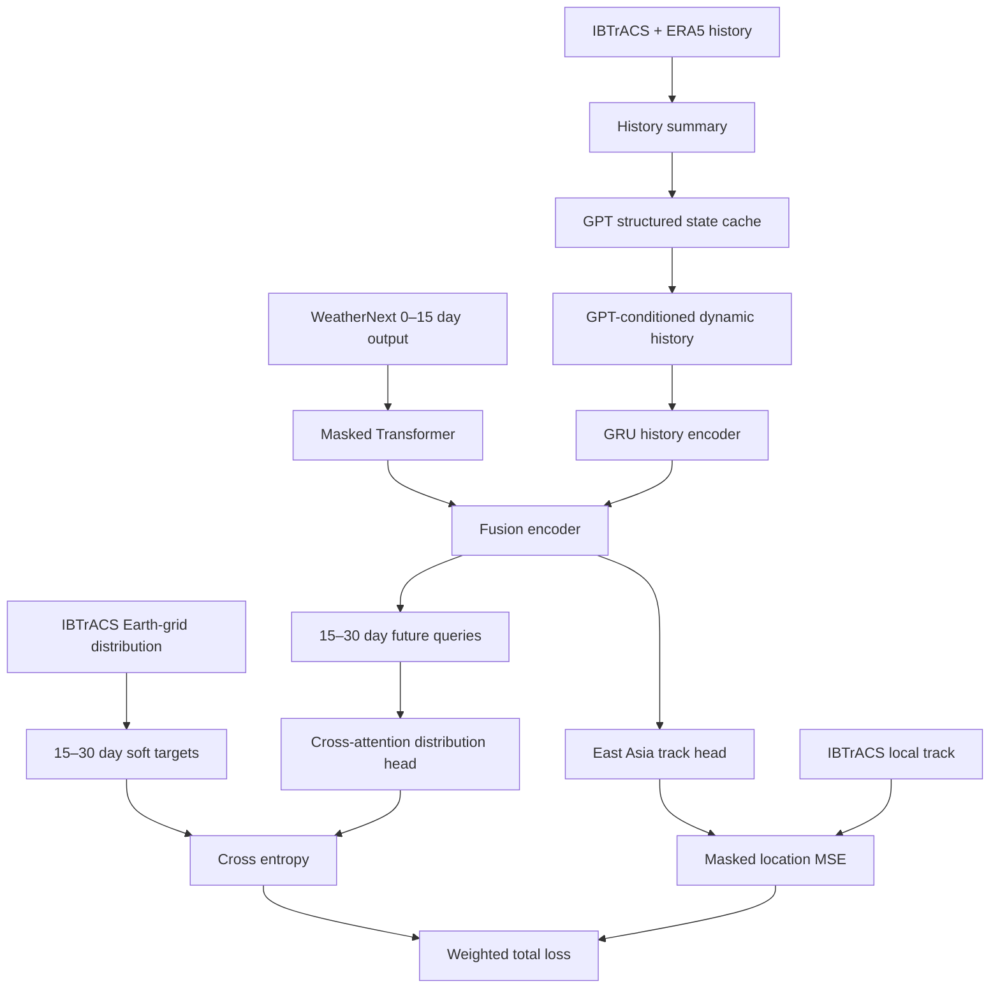

# Typhoon Pressure Data Loader

IBTrACS의 태풍 best-track과 ERA5 해면기압장(MSLP)을 결합하여, 태풍과 주변 고기압의 위치·기압 관계를 학습할 수 있는 통합 데이터셋을 만듭니다.

## 데이터 흐름

```text
IBTrACS CSV/NetCDF                    ERA5 NetCDF
storm_id, time, x/y, pressure        time, lat, lon, MSLP
          |                                  |
          +------------ time join -----------+
                             |
                 태풍 반경 R km의 고기압 검출
                             |
          typhoon state + surrounding high states
                             |
                   PyTorch sequence Dataset
```

## 1. IBTrACS trajectory loader

`load_ibtracs()`는 기관별 결측값을 고려해 선택한 기관(`TOKYO` 기본), WMO, USA 순서로 중심기압과 풍속을 보완합니다.

```python
from typhoon_pressure import IBTrACSConfig, load_ibtracs

tracks = load_ibtracs(
    "IBTrACS.ALL.v04r01.csv",
    IBTrACSConfig(basin="WP", agency="TOKYO", start="2020-01-01"),
)
```

출력: `storm_id, name, time, typhoon_lat, typhoon_lon, typhoon_pressure_hpa, typhoon_wind_kt`

## 2. ERA5 주변 고기압 추출

각 태풍 시각과 가장 가까운 ERA5 시각을 찾고, 기본 반경 2,500 km 안에서 MSLP 국소 최대이면서 주변 평균보다 1.5 hPa 이상 높은 중심을 찾습니다. 태풍 중심 250 km 안은 제외하고 고기압끼리 최소 400 km를 유지합니다.

```python
import xarray as xr
from typhoon_pressure import HighPressureConfig, extract_surrounding_highs

era5 = xr.open_mfdataset("era5_*.nc", combine="by_coords")
highs = extract_surrounding_highs(
    tracks, era5["msl"], HighPressureConfig(radius_km=2500, max_highs=3)
)
```

각 고기압은 절대 위치뿐 아니라 태풍 기준 `high_dx_km`, `high_dy_km`, 거리와 방위각을 가집니다.

## 3. 통합 및 DataLoader

```python
from torch.utils.data import DataLoader
from typhoon_pressure import build_integrated_dataset, TyphoonPressureDataset

integrated = build_integrated_dataset(tracks, highs)
dataset = TyphoonPressureDataset(integrated, history=8, horizon=20, max_highs=3)
loader = DataLoader(dataset, batch_size=32, shuffle=True)
```

- `history=8`: 6시간 간격 기준 과거 48시간
- `horizon=20`: 미래 120시간
- `history`: 태풍 4개 feature + 고기압당 4개 feature
- `target`: 미래 태풍 `[lat, lon, pressure_hPa, wind_kt]`
- `history_mask`, `target_mask`: IBTrACS 결측값과 검출되지 않은 고기압 구분

## 4. WeatherNext 2 초기조건 보정 API

WeatherNext 2의 전체 초기 대기장은 HRES/ERA5에서 가져오고, IBTrACS는 태풍 중심의 tracker seed와 선택적 vortex 보정 자료로 사용합니다.

### 초기조건의 의미

IBTrACS 한 지점은 태풍의 저차원 상태입니다.

```text
storm = [latitude, longitude, central pressure, maximum wind]
```

반면 WeatherNext 2의 초기조건은 위도·경도·고도·변수 축을 가진 전체 대기장입니다.

```text
initial_state[latitude, longitude, level, variable]
```

따라서 이 패키지는 IBTrACS를 전체 대기장의 대체재로 사용하지 않습니다. 다음과 같이 전체 분석장에 태풍 관측을 조건으로 결합합니다.

```text
HRES/ERA5 atmospheric state
             +
IBTrACS storm observation
             |
             v
InitialConditionBuilder
             |
             +-- tracker_seed
             +-- vortex_correction
             +-- auto
             |
             v
WeatherNextRequest
```

수식으로는 다음과 같습니다.

```text
X_initial = X_HRES/ERA5 + C(storm_IBTrACS)
```

`tracker_seed`에서는 `C=0`이므로 대기장을 수정하지 않습니다. `vortex_correction`에서는 태풍 중심 주변 MSLP anomaly만 보정합니다.

### 권장 사용 예제

```python
from typhoon_pressure import (
    CorrectionConfig,
    InitialConditionBuilder,
    StormObservation,
    make_weathernext_request,
)

storm = StormObservation.from_series(tracks.iloc[0])

builder = InitialConditionBuilder(
    mode="auto",
    config=CorrectionConfig(
        position_threshold_km=100,
        pressure_threshold_hpa=5,
        search_radius_km=500,
        correction_radius_km=400,
    ),
)

condition = builder.build(
    atmospheric_state=hres_or_era5_state,
    storm=storm,
)

request = make_weathernext_request(
    condition,
    horizon_hours=360,
)
```

생성되는 `WeatherInitialCondition`에는 보정된 대기장뿐 아니라 보정 판단에 사용된 정보가 포함됩니다.

```python
print(condition.applied_mode)
print(condition.position_error_km)
print(condition.pressure_error_hpa)
print(condition.model_center_before)
print(condition.metadata())
```

`WeatherNextRequest`의 구조는 다음과 같습니다.

```python
request.initial_state               # WN2에 전달할 전체 xarray.Dataset
request.tracker_seed                # storm_id, time, lat, lon, pressure, wind
request.horizon_hours               # 6시간 배수, 최대 360시간
request.initialization_metadata     # 보정 전 중심과 오차 및 적용 모드
```

지원 모드:

| mode | 동작 |
|---|---|
| `tracker_seed` | 전체 대기장을 수정하지 않고 IBTrACS를 cyclone tracker seed로만 사용 |
| `vortex_correction` | IBTrACS 위치·기압을 기준으로 MSLP vortex를 이동·보정 |
| `auto` | 위치 오차 100 km 또는 중심기압 오차 5 hPa 초과 시에만 보정 |

### `auto` 모드의 판단 과정

1. IBTrACS 시각과 가장 가까운 HRES/ERA5 시각을 선택합니다.
2. IBTrACS 중심 반경 500 km에서 MSLP 국소 최솟값을 검색합니다.
3. 모델 중심과 IBTrACS 중심의 great-circle distance를 계산합니다.
4. 모델 중심기압과 IBTrACS 중심기압의 차이를 계산합니다.
5. 위치 또는 기압 오차가 임계값을 넘을 때만 vortex correction을 적용합니다.

```text
position_error = great_circle(model_center, IBTrACS_center)
pressure_error = model_pressure - IBTrACS_pressure

correct = position_error > 100 km
       or abs(pressure_error) > 5 hPa
```

태풍이 분석장에 이미 정확하게 표현되어 있으면 `auto`는 자동으로 `tracker_seed`를 선택하여 불필요한 field 변형을 방지합니다.

### MSLP vortex correction

보정은 분석장 전체를 이동시키지 않고 태풍 주변 anomaly에만 적용됩니다.

```text
background = GaussianSmooth(MSLP)
vortex_anomaly = MSLP - background
```

기존 모델 중심 주변 anomaly를 제거하고, 해당 anomaly를 IBTrACS 중심으로 이동한 뒤 목표 중심기압과의 차이를 부드러운 거리 가중치로 적용합니다.

```text
weight(r) = exp(-0.5 * (r / correction_radius)^2)

corrected_MSLP
  = cleaned_background
  + relocated_vortex
  + weight(r) * pressure_adjustment
```

기본값:

| 설정 | 기본값 | 의미 |
|---|---:|---|
| `position_threshold_km` | 100 km | 위치 보정 판단 기준 |
| `pressure_threshold_hpa` | 5 hPa | 기압 보정 판단 기준 |
| `search_radius_km` | 500 km | 분석장 태풍 중심 검색 반경 |
| `correction_radius_km` | 400 km | vortex 보정 영향 반경 |
| `max_pressure_correction_hpa` | 25 hPa | 과도한 중심기압 변경 방지 |
| `local_window` | 7 | MSLP 국소 최솟값 검출 window |

### WeatherNext runner 연결

이 패키지는 대용량 JAX/TPU 의존성을 기본 loader에 강제로 설치하지 않도록 WN2
실행부를 optional dependency로 분리합니다. 파인튜닝 저장소에서 생성한
`weather-me-fine_tune_weight.npz`는 공식 checkpoint 형식으로 직접 로드할 수
있습니다.

```python
from typhoon_pressure import WeatherNextBackendConfig, build_weathernext_runner
from typhoon_pressure.weathernext_adapter import run_weathernext

config = WeatherNextBackendConfig(
    backend="pretrained",
    model_id="regional-wn2-35N45N",
    model_variant="WeatherNext2",
    release="v0.3.0",
    checkpoint="/weights/weather-me-fine_tune_weight.npz",
)
runner = build_weathernext_runner(config)
forecast = run_weathernext(runner, request)
```

이 runner에는 `fit()`과 optimizer가 없으며 checkpoint를 읽기 전용으로 로드합니다.
따라서 rollout 과정에서 추가 학습이 발생하거나 파인튜닝 weight가 사전학습
weight로 교체되지 않습니다. 공식 WN2가 요구하는 두 개의 6시간 입력장을
보존하려면 초기조건 builder에 `history_steps=2`를 지정합니다.

```bash
pip install -e '.[weathernext]'
```

공개 운영 WN2 가중치는 HRES 초기조건에 맞춰져 있으므로 실제 추론에는 HRES 사용을 우선 권장합니다. ERA5는 과거 실험, 전처리 검증과 보정 ablation에 사용할 수 있습니다.

### 보정 전후 평가

동일한 초기 시각과 태풍에 대해 다음 세 실험을 분리하십시오.

| 실험 | 대기장 | IBTrACS 역할 |
|---|---|---|
| Baseline | 원본 HRES/ERA5 | 사용하지 않음 |
| Tracker seed | 원본 HRES/ERA5 | 추적 초기 중심 |
| Corrected | 보정된 HRES/ERA5 | 추적 중심 + MSLP 보정 |

권장 평가 항목:

```text
6h/24h/72h/120h/360h track error (km)
central pressure error (hPa)
maximum wind error
first-step pressure tendency
ensemble track spread
vortex continuity after the first rollout
```

특히 첫 6시간 예측에서 중심기압이나 풍속이 갑자기 변하면 초기장이 동역학적으로 불균형하다는 신호입니다.

### 학습 sample에 초기화 metadata 포함

```python
sample = {
    "storm_id": condition.storm.storm_id,
    "init_time": condition.storm.time,
    "initial_state": request.initial_state,
    "tracker_seed": request.tracker_seed,
    "initialization_metadata": request.initialization_metadata,
    "target_15d": target,
}
```

`initialization_metadata`를 보존하면 보정 여부에 따른 성능을 별도로 분석할 수 있습니다.

`WeatherNextRequest`는 `initial_state`, `tracker_seed`, `horizon_hours`, 보정 metadata를 분리합니다. 실제 Google WN2 호출은 버전을 고정한 JAX/TPU runner에서 수행하도록 `WeatherNextRunner` 경계로 분리했습니다.

> 현재 vortex correction은 실험적인 MSLP-only 보정입니다. WN2 성능 실험에서는 `tracker_seed`를 baseline으로 두고, MSLP 보정 후 첫 rollout에서 바람·온도·습도장의 동역학적 균형이 유지되는지 반드시 비교해야 합니다.

### 현재 제한사항과 다음 확장

- 현재 위치·강도 보정은 `mean_sea_level_pressure`에만 적용됩니다.
- 경도 경계가 포함된 전 지구 field의 vortex 이동은 추가적인 cyclic interpolation 검증이 필요합니다.
- 기압만 바꾸면 바람과 열역학장의 균형이 깨질 수 있으므로 운영 예측에 바로 사용하면 안 됩니다.
- 다음 버전에서는 10 m/850 hPa 바람, 온도, 습도 anomaly를 함께 이동·스케일링해야 합니다.
- 보정된 field는 WN2가 기대하는 변수명, 단위, pressure level 및 좌표 순서를 만족해야 합니다.
- IBTrACS는 best-track 사후분석 자료이므로 실시간 시스템에서는 실제 operational advisory 자료로 교체해야 합니다.

## CLI

```bash
pip install -e '.[io,test]'

build-typhoon-pressure-data \
  --ibtracs IBTrACS.ALL.v04r01.csv \
  --era5 era5/2025_*.nc \
  --basin WP --agency TOKYO \
  --radius-km 2500 --max-highs 3 \
  --output integrated_typhoon_pressure.parquet

pytest
```

## 5. Small version: 두 가지 loss 학습

전체 시스템 구조도는 [`struct-picture/`](struct-picture/README.md)에서 단계별 Mermaid 그림으로 확인할 수 있습니다.

`src/typhoon_pressure/small_version/`은 [typnoon-disribution](https://github.com/nayehyeon61-glitch/typnoon-disribution)이 생성한 지구 격자분포와 이 저장소의 태풍·기압 history를 연결합니다.



```text
L_total = lambda_distribution * CE(IBTrACS distribution, predicted distribution)
        + lambda_track * MSE(East Asia target track, predicted track)
```

- 전 지구 head: 초기시각 기준 15–30일 뒤 IBTrACS 월별 공간분포를 soft target으로 사용
- 국지 head: 동아시아 `0–60°N, 100–180°E`에 있는 미래 위치만 mask하여 경로 loss 계산
- 기본 local horizon: 6시간 간격 20 step(5일)
- MSE는 km 단위 위치오차를 500 km로 정규화해 CE와 loss scale을 맞추며, 실제 RMSE(km)를 별도로 기록

```bash
pip install -e '.[io,small]'

build-typhoon-distribution-targets \
  --ibtracs data/IBTrACS.ALL.v04r01.csv \
  --basins WP \
  --output-dir data/distribution

train-small-typhoon-model \
  --integrated data/integrated_typhoon_pressure.parquet \
  --distribution data/distribution/spatial_distribution.csv \
  --history 8 --track-steps 20 \
  --distribution-weight 1.0 --track-weight 1.0
```

WeatherNext 연결 버전:

```bash
build-storm-split \
  --integrated data/integrated_typhoon_pressure.parquet \
  --output data/storm_split.csv

tokenize-weathernext-output \
  --forecast data/weathernext/forecast.nc \
  --storm-id 2025001N12000 \
  --init-time 2025-08-01T00:00:00 \
  --output-dir data/weathernext_tokens

train-weathernext-transformer \
  --integrated data/integrated_typhoon_pressure.parquet \
  --distribution data/distribution/spatial_distribution.csv \
  --split-manifest data/storm_split.csv \
  --weathernext-token-dir data/weathernext_tokens
```

Transformer 입력에는 변수별 결측 mask, token attention mask, history mask와 기본 15% random input mask를 모두 적용합니다. WeatherNext의 0–15일 예측 전체는 사용 가능한 입력이므로 causal mask는 두지 않으며, 15–30일 target은 입력에서 완전히 분리됩니다.

### GPT API state feature

태풍·주변 고기압 history의 제한된 수치 요약을 OpenAI Responses API Structured Outputs에 전달해 10차원 synoptic state를 추출할 수 있습니다. GPT는 학습 중 호출하지 않고 결과를 사전에 cache합니다. Cached state는 history representation을 FiLM 방식으로 조절하는 동시에 WeatherNext token/channel gate를 제어합니다.

```bash
pip install -e '.[io,small,gpt]'
export OPENAI_API_KEY=...

build-gpt-state-cache \
  --integrated data/integrated_typhoon_pressure.parquet \
  --output-dir data/gpt_states \
  --on-error mask

train-weathernext-transformer \
  --integrated data/integrated_typhoon_pressure.parquet \
  --distribution data/distribution/spatial_distribution.csv \
  --split-manifest data/storm_split.csv \
  --weathernext-token-dir data/weathernext_tokens \
  --gpt-state-dir data/gpt_states
```

API 실패 record는 임의 값으로 대체하지 않습니다. 10차원 값과 mask를 모두 0으로 두어 FiLM은 `γ=β=0`, Router는 `g_token=g_channel=1`인 exact identity fallback을 사용합니다. `--gpt-state-dir`을 지정하면 token key 전체의 cache coverage를 학습 전에 검사하며, 생략하면 GPT adapter module 자체가 생성되지 않습니다.

자세한 데이터 계약과 설계 근거는 [`small_version/README.md`](src/typhoon_pressure/small_version/README.md)에 정리했습니다.

## 6. Utility metrics와 IBTrACS evaluation

WeatherNext 실행 방식 선택은 [`weathernext/README.md`](weathernext/README.md), IBTrACS 기준 backend별 평가는 [`evaluation/README.md`](evaluation/README.md)에 정리했습니다.

재사용 metric은 [`utility/`](utility/README.md), 평가 실행 구조는 [`evaluation/`](evaluation/README.md)에 정리했습니다. 실제 Python package는 각각 `src/typhoon_pressure/utility/`, `src/typhoon_pressure/evaluation/`에 있습니다.

현재 evaluation은 예측 결과를 **IBTrACS 관측과만** `storm_id + absolute time`으로 결합합니다.

```bash
evaluate-ibtracs-predictions \
  --predictions data/predictions.csv \
  --ibtracs data/IBTrACS.ALL.v04r01.csv \
  --basin WP \
  --agency TOKYO \
  --output-dir evaluation/ibtracs
```

기본 track metric은 great-circle mean error, RMSE, median, 90 percentile과 maximum이며, 예측 파일에 기압·풍속 열이 있으면 bias, MAE, RMSE도 계산합니다. `lead_hours`가 있으면 lead-time별 결과를 추가로 생성합니다.

```bash
evaluate-weathernext-transformer \
  --checkpoint checkpoints/weathernext_transformer.pt \
  --integrated data/integrated_typhoon_pressure.parquet \
  --weathernext-token-dir data/weathernext_tokens \
  --gpt-state-dir data/gpt_states \
  --split-manifest data/storm_split.csv \
  --split test \
  --output-dir evaluation/weathernext_test
```

## 중요한 설계 조건

- IBTrACS CSV의 두 번째 행은 단위 행이므로 자동으로 건너뜁니다.
- 풍속은 기관마다 1분/10분 평균 정의가 다르므로 한 기관을 일관되게 선택해야 합니다.
- ERA5 고기압은 관측 label이 아니라 MSLP에서 계산한 파생 feature입니다.
- train/validation/test는 row가 아니라 `storm_id` 단위로 분리해야 같은 태풍이 양쪽에 포함되는 leakage를 막을 수 있습니다.
- 경도 180° 경계는 wrapped longitude 차이로 처리합니다.
