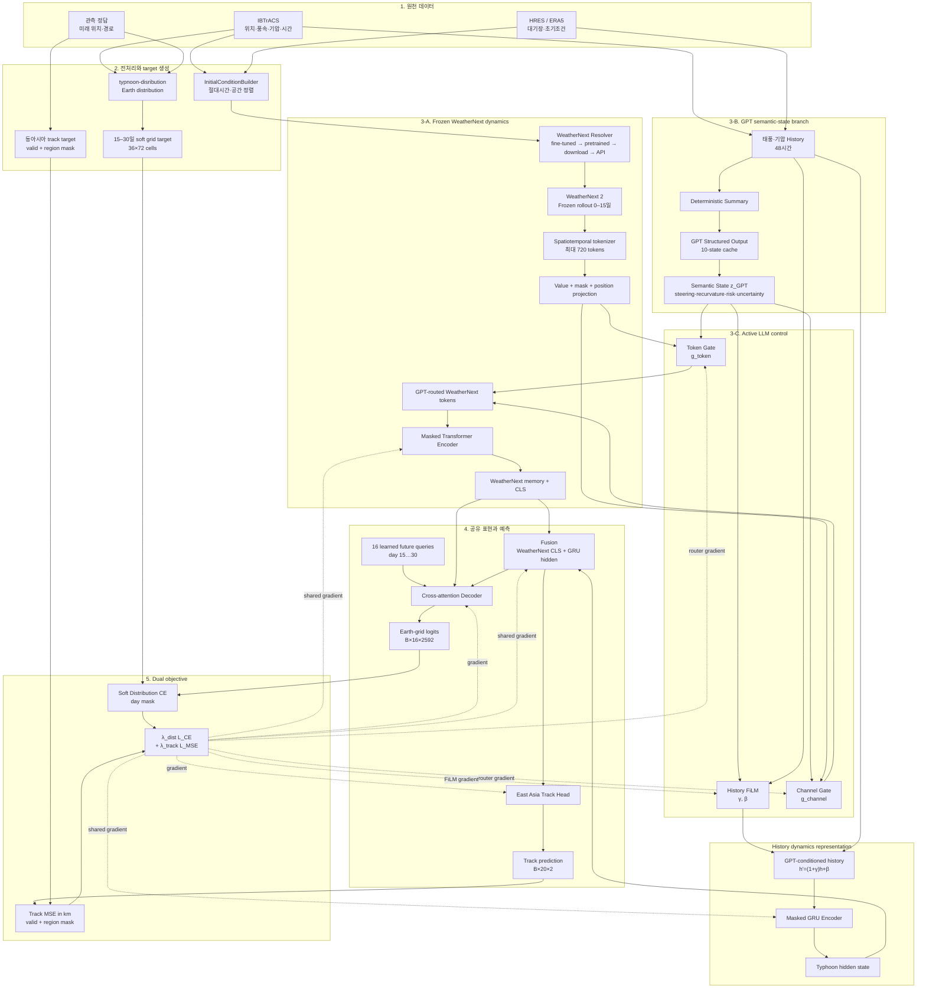

# 01. Overall System

현재 시스템은 WeatherNext 2의 물리적 forecast dynamics를 고정하고, GPT가 생성한 synoptic state를 두 경로에서 능동적으로 사용합니다.

1. History FiLM conditioning
2. WeatherNext Token / Channel Router



## 핵심 해석

```text
WeatherNext 2 = frozen physical forecast dynamics
GPT state     = semantic state
GPT Router    = semantic state → routing policy
Transformer   = routed WeatherNext representation learner
```

WeatherNext 2와 GPT API 자체에는 학습 gradient가 전달되지 않습니다. 반면 GPT state를 입력받는 FiLM adapter와 Token/Channel Router는 후단 loss에서 학습됩니다.
