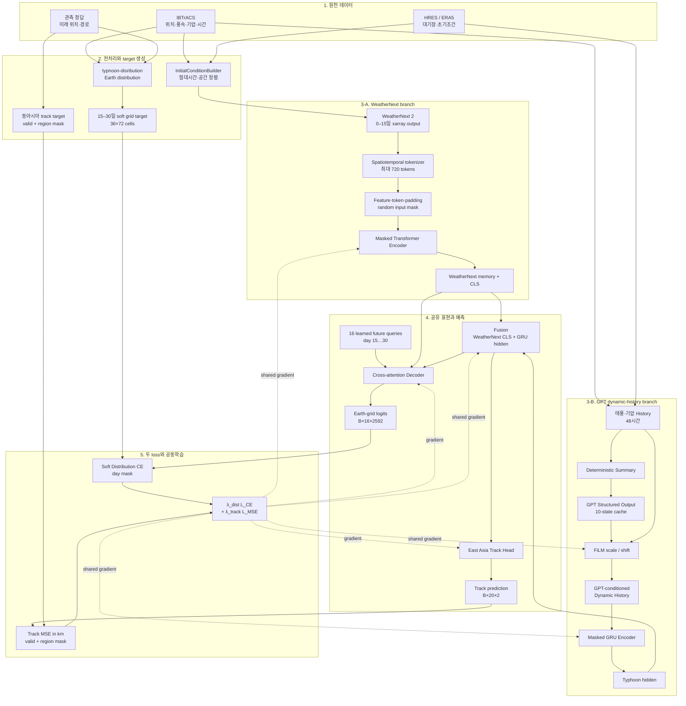

# 01. Overall System

```mermaid
flowchart TB
    subgraph SOURCE["1. 원천 데이터"]
        direction LR
        IB["IBTrACS<br/>위치·풍속·기압·시간"]
        ERA["HRES / ERA5<br/>대기장·초기조건"]
        OBS["관측 정답<br/>미래 위치·경로"]
    end

    subgraph TARGETS["2. 전처리와 target 생성"]
        direction LR
        INIT["InitialConditionBuilder<br/>절대시간·공간 정렬"]
        DS["typnoon-disribution<br/>Earth distribution"]
        GT["15–30일 soft grid target<br/>36×72 cells"]
        TT["동아시아 track target<br/>valid + region mask"]
    end

    IB --> INIT
    ERA --> INIT
    IB --> DS
    OBS --> DS
    DS --> GT
    OBS --> TT

    subgraph WNB["3-A. WeatherNext branch"]
        direction TB
        WN["WeatherNext 2<br/>0–15일 xarray output"]
        TOK["Spatiotemporal tokenizer<br/>최대 720 tokens"]
        FM["Feature·token·padding<br/>random input mask"]
        TE["Masked Transformer Encoder"]
        MEM["WeatherNext memory + CLS"]
    end

    INIT --> WN
    WN --> TOK
    TOK --> FM
    FM --> TE
    TE --> MEM

    subgraph HB["3-B. GPT dynamic-history branch"]
        direction TB
        HIS["태풍·기압 History<br/>48시간"]
        SUM["Deterministic Summary"]
        API["GPT Structured Output<br/>10-state cache"]
        FILM["FiLM scale / shift"]
        DH["GPT-conditioned<br/>Dynamic History"]
        GRU["Masked GRU Encoder"]
        HH["Typhoon hidden"]
    end

    IB --> HIS
    ERA --> HIS
    HIS --> SUM
    SUM --> API
    API --> FILM
    HIS --> FILM
    FILM --> DH
    DH --> GRU
    GRU --> HH

    subgraph MODEL["4. 공유 표현과 예측"]
        direction TB
        FUS["Fusion<br/>WeatherNext CLS + GRU hidden"]
        Q["16 learned future queries<br/>day 15…30"]
        DEC["Cross-attention Decoder"]
        GRID["Earth-grid logits<br/>B×16×2592"]
        TH["East Asia Track Head"]
        TP["Track prediction<br/>B×20×2"]
    end

    MEM --> FUS
    HH --> FUS
    Q --> DEC
    MEM --> DEC
    FUS --> DEC
    DEC --> GRID
    FUS --> TH
    TH --> TP

    subgraph OBJECTIVE["5. 두 loss와 공동학습"]
        direction LR
        CE["Soft Distribution CE<br/>day mask"]
        MSE["Track MSE in km<br/>valid + region mask"]
        TOTAL["λ_dist L_CE<br/>+ λ_track L_MSE"]
    end

    GRID --> CE
    GT --> CE
    TP --> MSE
    TT --> MSE
    CE --> TOTAL
    MSE --> TOTAL

    TOTAL -. "gradient" .-> DEC
    TOTAL -. "gradient" .-> TH
    TOTAL -. "shared gradient" .-> FUS
    TOTAL -. "shared gradient" .-> TE
    TOTAL -. "shared gradient" .-> GRU
    TOTAL -. "shared gradient" .-> FILM
```

WeatherNext 2와 GPT API는 외부 추론·전처리 단계입니다. 학습 gradient는 cache된 입력 이후의 Transformer, FiLM, GRU, fusion과 두 prediction head에 전달됩니다.
