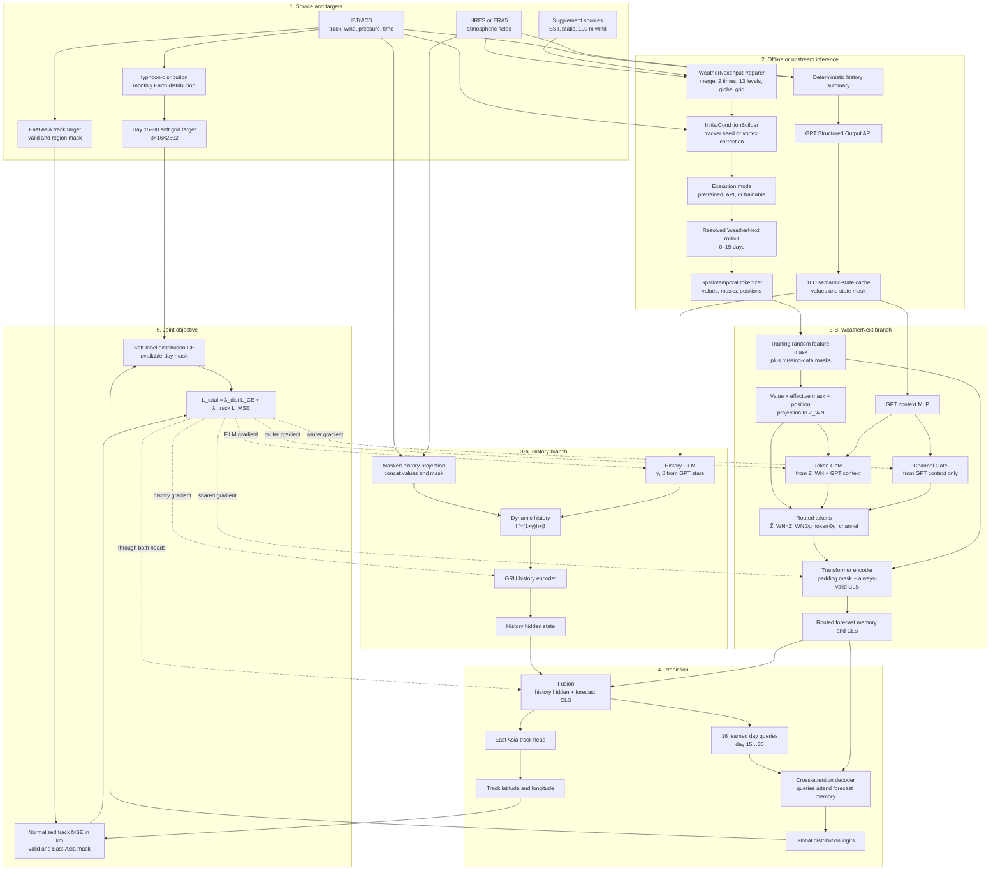

# 01. Overall System

아래 구조는 `feature/weathernext-resolver`의 실제 실행 경로를 기준으로 합니다. WeatherNext와 GPT API는 downstream 학습 밖에서 실행되고, cache/token을 입력받는 FiLM·Router·GRU·Transformer·두 예측 head만 공동 학습됩니다.

## 학습 경계

| 구성요소 | downstream 학습 상태 | 비고 |
|---|---:|---|
| Pretrained/API WeatherNext rollout | 고정 | 공식/fine-tuned checkpoint와 API는 inference-only |
| Trainable WeatherNext mode | upstream 별도 학습 | 명시적 factory로 fit 후 token 생성; dual loss와 autograd 연결 없음 |
| GPT API와 state cache | 고정 | 학습 loop에서 API를 호출하지 않음 |
| FiLM, GPTForecastRouter | 학습 | 두 loss의 gradient를 받음 |
| GRU, Transformer, Fusion, Decoder, Heads | 학습 | 공동 최적화 |

`--gpt-state-dir`을 지정하면 학습 시작 전에 모든 WeatherNext token key의 GPT cache 존재 여부를 검사합니다. 존재하지만 API 실패로 masked된 record는 FiLM `γ=β=0`, Router `g_token=g_channel=1`의 identity fallback이며, `--require-valid-gpt-states`로 이 경우도 오류 처리할 수 있습니다.
