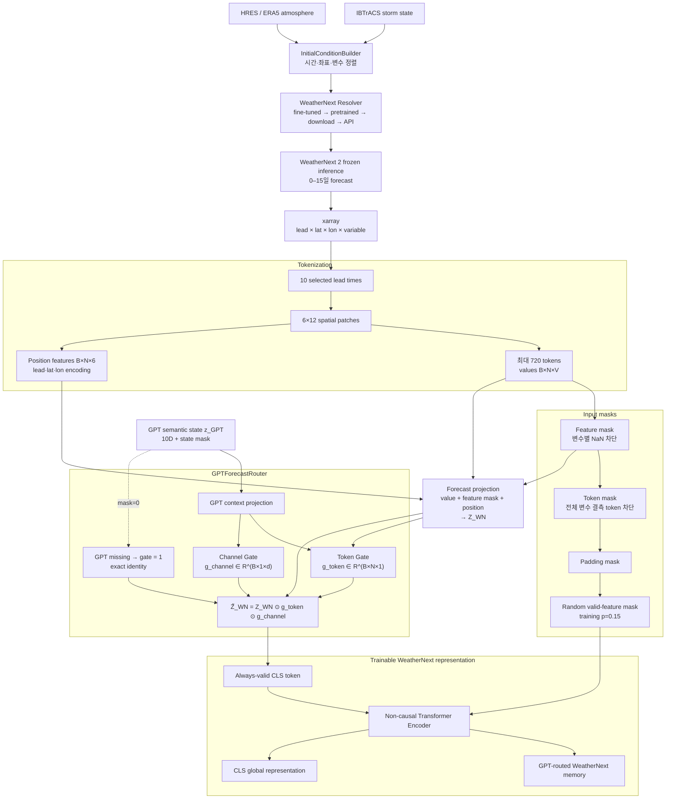

# 02. WeatherNext Output to GPT-routed Transformer Input



## Router 수식

```math
g_{token}=2\sigma(f_{token}(Z_{WN},z_{GPT}))
```

```math
g_{channel}=2\sigma(f_{channel}(z_{GPT}))
```

```math
\tilde Z_{WN}=Z_{WN}\odot g_{token}\odot g_{channel}
```

마지막 gate layer는 0으로 초기화하므로 학습 시작 시 `2σ(0)=1`입니다. 즉 기존 Transformer와 동일한 입력으로 시작하고, 학습을 통해 GPT state가 spatial/lead-time token 및 latent channel의 중요도를 점진적으로 조절합니다.
