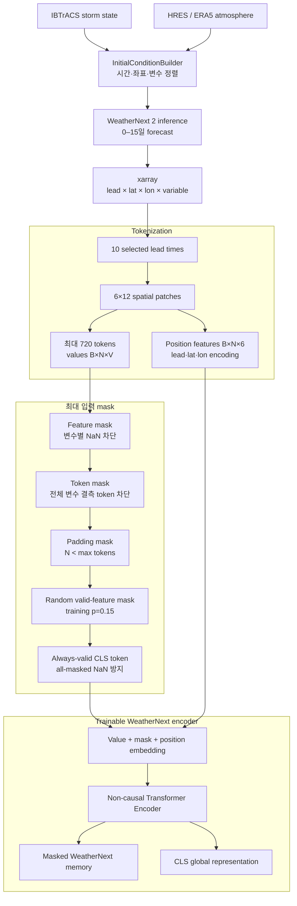

# 02. WeatherNext Output to Transformer Input

```mermaid
flowchart TB
    IB["IBTrACS storm state"]
    ATM["HRES / ERA5 atmosphere"]
    BUILDER["InitialConditionBuilder<br/>시간·좌표·변수 정렬"]
    WN["WeatherNext 2 inference<br/>0–15일 forecast"]
    XR["xarray<br/>lead × lat × lon × variable"]

    IB --> BUILDER
    ATM --> BUILDER
    BUILDER --> WN
    WN --> XR

    subgraph TOKENIZE["Tokenization"]
        direction TB
        LEAD["10 selected lead times"]
        PATCH["6×12 spatial patches"]
        TOKEN["최대 720 tokens<br/>values B×N×V"]
        POS["Position features B×N×6<br/>lead·lat·lon encoding"]
    end

    XR --> LEAD
    LEAD --> PATCH
    PATCH --> TOKEN
    PATCH --> POS

    subgraph MASKS["최대 입력 mask"]
        direction TB
        FEATURE["Feature mask<br/>변수별 NaN 차단"]
        TOKENMASK["Token mask<br/>전체 변수 결측 token 차단"]
        PAD["Padding mask<br/>N < max tokens"]
        RANDOM["Random valid-feature mask<br/>training p=0.15"]
        CLS["Always-valid CLS token<br/>all-masked NaN 방지"]
    end

    TOKEN --> FEATURE
    FEATURE --> TOKENMASK
    TOKENMASK --> PAD
    PAD --> RANDOM
    RANDOM --> CLS

    subgraph ENCODER["Trainable WeatherNext encoder"]
        direction TB
        EMBED["Value + mask + position embedding"]
        TF["Non-causal Transformer Encoder"]
        MEMORY["Masked WeatherNext memory"]
        GLOBAL["CLS global representation"]
    end

    CLS --> EMBED
    POS --> EMBED
    EMBED --> TF
    TF --> MEMORY
    TF --> GLOBAL
```

WeatherNext의 0–15일 출력 전체가 입력 시점에 이미 제공되므로 encoder에는 causal mask를 사용하지 않습니다. 학습 정답인 15–30일 자료는 Transformer 입력에서 완전히 제외합니다.
