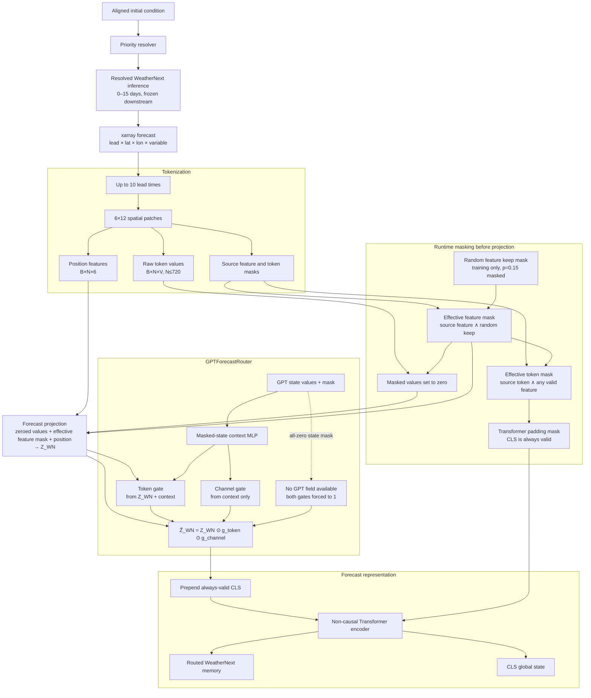

# 02. WeatherNext Output to GPT-routed Transformer Input

이 그림은 mask가 적용되는 정확한 순서와 Router의 실제 입력 의존성을 보여줍니다.



```math
g_{token}=2\sigma\!\left(f_{token}(Z_{WN}+f_{ctx}(z_{GPT},m_{GPT}))\right)
```

```math
g_{channel}=2\sigma\!\left(f_{channel}(f_{ctx}(z_{GPT},m_{GPT}))\right)
```

```math
\tilde Z_{WN}=Z_{WN}\odot g_{token}\odot g_{channel}
```

마지막 gate layer의 weight와 bias는 0으로 초기화되어 첫 forward는 `2σ(0)=1`입니다. Random mask는 Router 뒤가 아니라 projection 전에 적용되고, padding mask는 Router가 아니라 Transformer attention에 적용됩니다.
