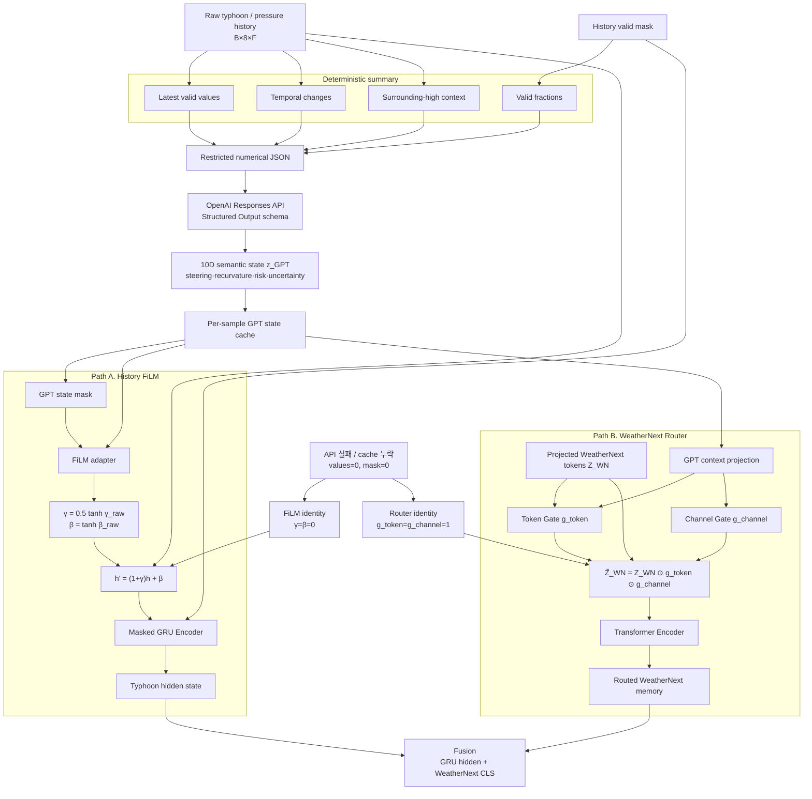

# 03. GPT Semantic State: History FiLM + Forecast Router

GPT는 이제 단순한 별도 feature branch가 아닙니다. 동일한 semantic state가

1. 관측 history representation을 FiLM으로 조절하고,
2. WeatherNext forecast token의 공간·lead-time·latent-channel 중요도를 routing합니다.

즉 `z_GPT`는 현재 시스템에서 **conditioning state + routing policy source**로 사용됩니다.
