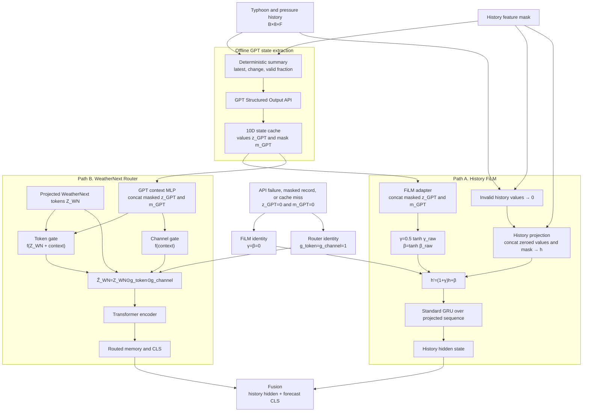

# 03. GPT Semantic State: History FiLM + Forecast Router

GPT state는 같은 cache record에서 읽히지만 두 개의 서로 다른 trainable adapter를 제어합니다.

`history_mask`는 GRU의 `pack_padded_sequence`나 recurrent-step skip으로 사용되지 않습니다. 실제 구현은 결측값을 0으로 바꾸고 mask 자체를 projection 입력에 포함하므로, 정확한 표현은 **mask-aware history projection + standard GRU**입니다.

State mask 중 하나라도 유효하면 GPT adapter가 활성화되고, 부분 mask 자체도 context 입력에 포함됩니다. 모든 state field가 무효일 때만 두 adapter가 강제로 identity가 됩니다.
