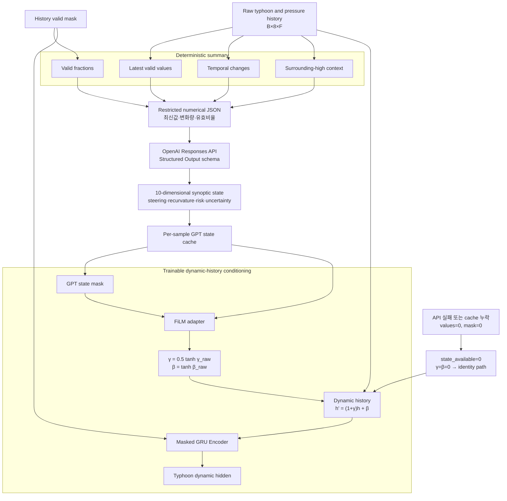

# 03. GPT-conditioned Dynamic History

```mermaid
flowchart TB
    RAW["Raw typhoon and pressure history<br/>B×8×F"]
    HMASK["History valid mask"]

    subgraph SUMMARY["Deterministic summary"]
        direction LR
        LATEST["Latest valid values"]
        CHANGE["Temporal changes"]
        FRACTION["Valid fractions"]
        HIGH["Surrounding-high context"]
    end

    RAW --> LATEST
    RAW --> CHANGE
    HMASK --> FRACTION
    RAW --> HIGH

    JSON["Restricted numerical JSON<br/>최신값·변화량·유효비율"]
    LATEST --> JSON
    CHANGE --> JSON
    FRACTION --> JSON
    HIGH --> JSON

    API["OpenAI Responses API<br/>Structured Output schema"]
    STATE["10-dimensional synoptic state<br/>steering·recurvature·risk·uncertainty"]
    CACHE["Per-sample GPT state cache"]

    JSON --> API
    API --> STATE
    STATE --> CACHE

    subgraph CONDITION["Trainable dynamic-history conditioning"]
        direction TB
        SMASK["GPT state mask"]
        ADAPTER["FiLM adapter"]
        PARAM["γ = 0.5 tanh γ_raw<br/>β = tanh β_raw"]
        DYNAMIC["Dynamic history<br/>h' = (1+γ)h + β"]
        GRU["Masked GRU Encoder"]
        HIDDEN["Typhoon dynamic hidden"]
    end

    CACHE --> SMASK
    CACHE --> ADAPTER
    SMASK --> ADAPTER
    ADAPTER --> PARAM
    RAW --> DYNAMIC
    PARAM --> DYNAMIC
    HMASK --> GRU
    DYNAMIC --> GRU
    GRU --> HIDDEN

    MISSING["API 실패 또는 cache 누락<br/>values=0, mask=0"]
    IDENTITY["state_available=0<br/>γ=β=0 → identity path"]
    MISSING --> IDENTITY
    IDENTITY --> DYNAMIC
```

GPT는 GRU와 병렬로 fusion되는 별도 branch가 아닙니다. GPT state가 먼저 history representation을 FiLM 방식으로 변환하고, dynamic history가 GRU에 입력되는 직렬 구조입니다.
