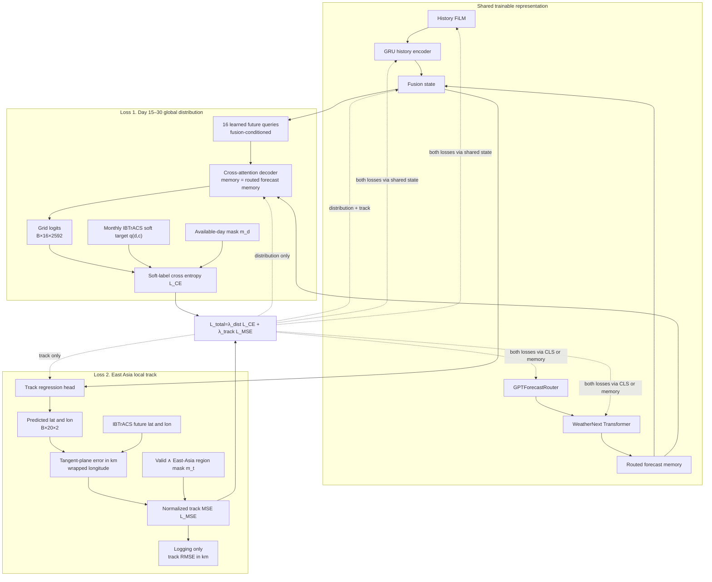

# 04. Dual-loss Training and Gradient Paths



```math
L_{CE}=-\frac{\sum_d m_d\sum_c q_{d,c}\log\operatorname{softmax}(z_{d})_c}{\sum_d m_d}
```

```math
L_{MSE}=\frac{\sum_t m_t(e_{x,t}^2+e_{y,t}^2)}{\sum_t m_t\,(500\text{ km})^2}
```

분포 branch는 routed memory에 직접 cross-attention하고 fusion state로 query를 조건화합니다. 경로 branch는 fusion state를 사용합니다. 따라서 두 loss 모두 Router와 Transformer에 도달하지만, 도달 경로는 서로 다릅니다. 분포는 memory와 CLS/fusion 두 경로, track은 CLS/fusion 경로를 사용합니다.

유효한 distribution day 또는 track point가 전혀 없는 batch는 해당 loss를 미분 가능한 0으로 반환합니다.
