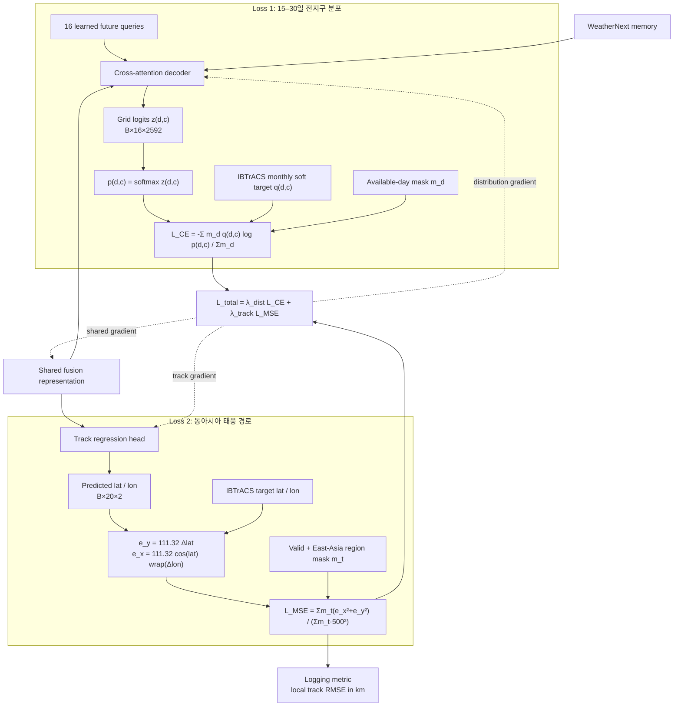

# 04. Dual-loss Training

```mermaid
flowchart TB
    MEM["WeatherNext memory"]
    FUSION["Shared fusion representation"]

    subgraph DIST["Loss 1: 15–30일 전지구 분포"]
        direction TB
        QUERY["16 learned future queries"]
        DEC["Cross-attention decoder"]
        LOGIT["Grid logits z(d,c)<br/>B×16×2592"]
        SOFTMAX["p(d,c) = softmax z(d,c)"]
        QT["IBTrACS monthly soft target q(d,c)"]
        DMASK["Available-day mask m_d"]
        CE["L_CE = -Σ m_d q(d,c) log p(d,c) / Σm_d"]
    end

    QUERY --> DEC
    MEM --> DEC
    FUSION --> DEC
    DEC --> LOGIT
    LOGIT --> SOFTMAX
    SOFTMAX --> CE
    QT --> CE
    DMASK --> CE

    subgraph TRACK["Loss 2: 동아시아 태풍 경로"]
        direction TB
        HEAD["Track regression head"]
        PRED["Predicted lat / lon<br/>B×20×2"]
        TARGET["IBTrACS target lat / lon"]
        TMASK["Valid + East-Asia region mask m_t"]
        KM["e_y = 111.32 Δlat<br/>e_x = 111.32 cos(lat) wrap(Δlon)"]
        MSE["L_MSE = Σm_t(e_x²+e_y²) / (Σm_t·500²)"]
    end

    FUSION --> HEAD
    HEAD --> PRED
    PRED --> KM
    TARGET --> KM
    KM --> MSE
    TMASK --> MSE

    TOTAL["L_total = λ_dist L_CE + λ_track L_MSE"]
    METRIC["Logging metric<br/>local track RMSE in km"]

    CE --> TOTAL
    MSE --> TOTAL
    MSE --> METRIC

    TOTAL -. "distribution gradient" .-> DEC
    TOTAL -. "track gradient" .-> HEAD
    TOTAL -. "shared gradient" .-> FUSION
```

두 loss는 각 head를 직접 학습하면서 fusion, WeatherNext Transformer, GRU와 FiLM adapter에는 공유 gradient를 전달합니다. 정규화된 MSE와 별도로 km 단위 RMSE도 기록합니다.
