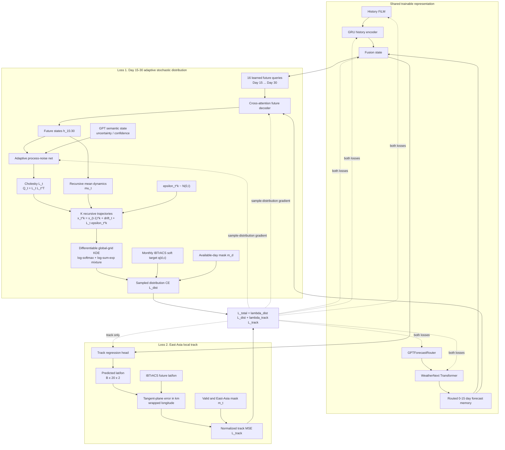

# 04. Dual-loss Training with Adaptive Distribution Sampling



## Time-correlated sampling

For lead days `15, 16, ..., 30`, a sample member keeps the same identity through time:

```math
x_{15}^{(k)} = \mu_{15} + L_{15}\epsilon_{15}^{(k)}
```

```math
x_t^{(k)} = x_{t-1}^{(k)} + \Delta\mu_t + L_t\epsilon_t^{(k)},\qquad t>15
```

with

```math
Q_t=L_tL_t^\top,\qquad \epsilon_t^{(k)}\sim\mathcal N(0,I).
```

`L_t` is parameterized so `Q_t` is positive definite. The process-noise condition receives the future WeatherNext/fusion state and, when available, GPT semantic state. Thus the learned spread can adapt to forecast context and semantic uncertainty.

## Differentiable distribution supervision

The `K` sampled trajectories are softly rasterized to the same global grid as the existing IBTrACS distribution target. Instead of a non-differentiable histogram, each sample contributes a smooth spatial kernel. The mixture is evaluated stably in log space using `log-softmax` and `log-sum-exp`, producing `log p_sample(d,c)`.

```math
L_{dist}=-\frac{\sum_d m_d\sum_c q_{d,c}\log p_{sample}(d,c)}{\sum_d m_d}.
```

The local-track branch is unchanged:

```math
L_{track}=\frac{\sum_t m_t(e_{x,t}^2+e_{y,t}^2)}{\sum_t m_t\,(500\text{ km})^2}.
```

The current sampler is **Kalman-inspired adaptive process noise**, not yet a full Kalman measurement-update layer: it learns `Q_t` and propagates uncertainty recursively after the routed WeatherNext representation. A future extension can add explicit pseudo-observation covariance `R_t`, innovation, and Kalman gain.

The direct categorical `distribution_logits` output remains available for backward-compatible diagnostics, but the WeatherNext fusion model's primary distribution loss now uses the sampled trajectory distribution.
