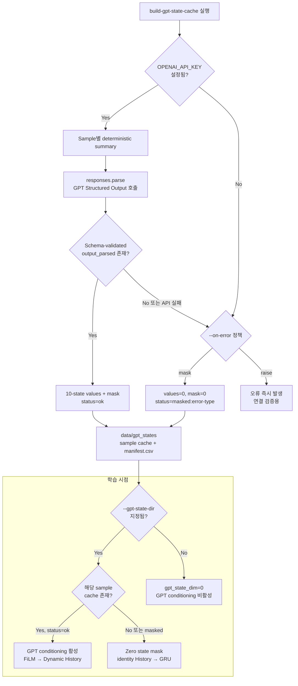

# 05. GPT API and Cache Runtime

GPT는 학습 loop 안에서 반복 호출하지 않습니다. 먼저 cache를 만들고 학습에서는 cache만 읽습니다. 최초 연결 검증에는 `--on-error raise`를 사용하고, `completed > 0`, `masked = 0`, `manifest.csv`의 `status=ok`로 확인합니다.
