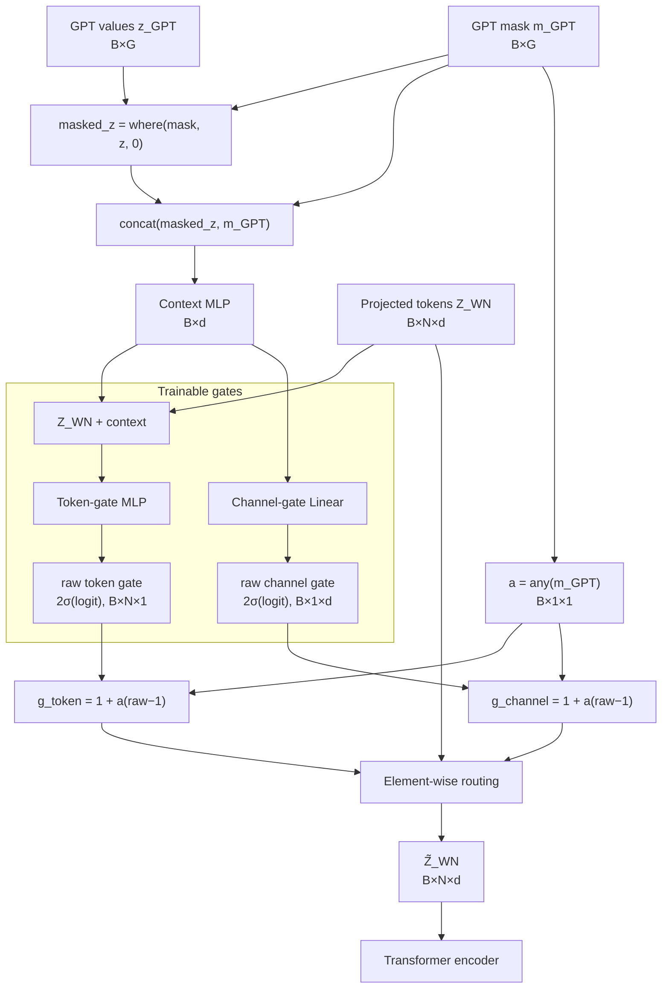

# 06. GPT Forecast Router



```math
c=f_{ctx}(\operatorname{concat}(z_{GPT}\odot m_{GPT},m_{GPT}))
```

```math
g_{token}=1+a\left(2\sigma(f_{token}(Z_{WN}+c))-1\right)
```

```math
g_{channel}=1+a\left(2\sigma(f_{channel}(c))-1\right)
```

```math
\boxed{\tilde Z_{WN}=Z_{WN}\odot g_{token}\odot g_{channel}}
```

## 초기화와 학습

마지막 token-gate layer와 channel-gate layer의 weight/bias는 0으로 초기화됩니다. 첫 forward에서 두 gate는 정확히 1이며 기존 모델 입력을 보존합니다. 첫 backward에서는 두 마지막 layer가 gradient를 받고, optimizer step 이후 gate가 1에서 벗어나면서 앞단 context/token network에도 gradient가 전달됩니다.

Router 출력에는 active fraction, 유효 token의 평균 gate, channel 평균 gate, sample별 gate map이 포함됩니다. 모든 forecast token이 mask된 경우 token-gate 평균은 해석 가능한 identity 값 `1`로 기록합니다.
