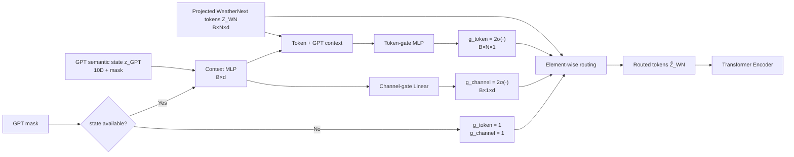

# 06. GPT Forecast Router

이 그림은 현재 추가된 `GPTForecastRouter`만 분리해서 설명합니다.



## Mathematical form

```math
g_{token}=2\sigma\left(f_{token}(Z_{WN},z_{GPT})\right)
```

```math
g_{channel}=2\sigma\left(f_{channel}(z_{GPT})\right)
```

```math
\tilde Z_{WN}
=
Z_{WN}\odot g_{token}\odot g_{channel}
```

## 왜 `2σ` 인가?

초기 마지막 layer를 0으로 두면

```math
2\sigma(0)=1
```

이므로 처음에는 기존 모델과 정확히 동일한 identity routing으로 시작합니다.

```text
training start:
    gate = 1

training progresses:
    important token/channel   > 1
    less useful token/channel < 1
```

## 의미

```text
GPT semantic state
      ↓
"현재 어떤 synoptic feature가 중요한가?"
      ↓
Token Gate    → 어느 공간/lead-time을 볼지
Channel Gate  → 어떤 latent representation을 강조할지
      ↓
Transformer
```

따라서 GPT가 예를 들어 높은 `recurvature_score`, `subtropical_high_influence`, `track_uncertainty`를 생성하면, 학습된 Router는 그 semantic state와 관련된 WeatherNext의 특정 spatial/lead-time token 및 latent channel에 더 큰 gate를 줄 수 있습니다.
