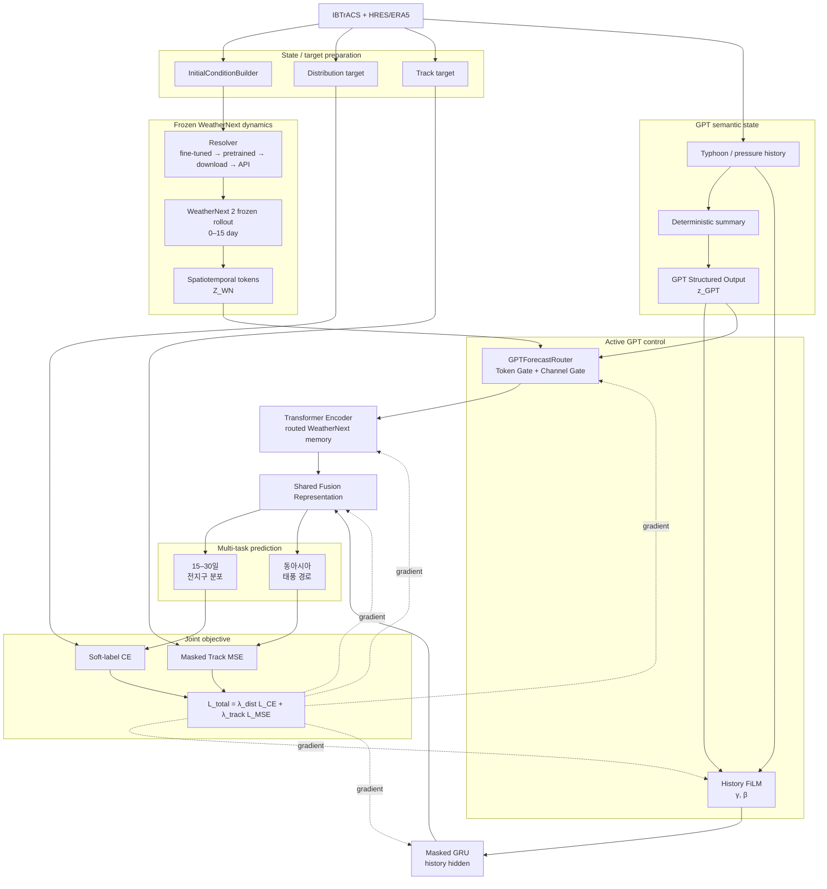

# Typhoon Forecasting System Diagrams

이 폴더는 현재 구현된 WeatherNext 2 + GPT semantic-state 기반 태풍 장기예측 시스템을 Mermaid 구조도로 정리합니다.

현재 GPT는 단순한 conditioning feature가 아니라 두 경로에서 능동적으로 작동합니다.

1. History FiLM conditioning
2. WeatherNext Token / Channel Router

## 그림 목록

| 문서 | 내용 |
|---|---|
| [01-overall-system.md](01-overall-system.md) | Resolver부터 GPT Router, Fusion, dual loss까지 전체 구조 |
| [02-weathernext-transformer.md](02-weathernext-transformer.md) | Frozen WeatherNext 0–15일 출력 → token → GPT Router → Transformer |
| [03-gpt-dynamic-history.md](03-gpt-dynamic-history.md) | GPT semantic state의 두 역할: History FiLM + WeatherNext Router |
| [04-dual-loss-training.md](04-dual-loss-training.md) | 15–30일 분포 CE와 동아시아 경로 MSE |
| [05-gpt-cache-runtime.md](05-gpt-cache-runtime.md) | GPT API 호출, cache 생성과 실패·누락 처리 |
| [06-gpt-forecast-router.md](06-gpt-forecast-router.md) | GPT Token Gate / Channel Gate 상세 구조 |

## 최신 전체 흐름



## State / Dynamics / Router 관점

```text
Physical State
    ERA5 / HRES atmosphere
    IBTrACS cyclone observation

Physical Dynamics
    WeatherNext 2 F_theta
    (frozen during downstream training)

Semantic State
    GPT structured state z_GPT

Routing Policy
    z_GPT → Token Gate + Channel Gate

Prediction Operator
    Routed WeatherNext Transformer + History GRU + Fusion
```

## 핵심 설정

| 항목 | 현재 구조 |
|---|---|
| History | 6시간 간격 8 step, 총 48시간 |
| WeatherNext 입력 | 0–15일 예보장 |
| WeatherNext source | fine-tuned → pretrained → download → API priority resolver |
| WeatherNext training state | downstream 학습에서는 frozen |
| WeatherNext token | 최대 10 × 6 × 12 = 720 tokens |
| GPT state | Structured Output 10차원, 사전 cache |
| GPT 역할 A | History FiLM conditioning |
| GPT 역할 B | WeatherNext Token / Channel Router |
| Router 초기화 | `g_token = g_channel = 1` identity |
| 장기 분포 예측 | 15일부터 30일까지 16 future queries |
| 전지구 격자 | 위도 36 × 경도 72 = 2,592 cells |
| 동아시아 영역 | 0–60°N, 100–180°E |
| 경로 예측 | 6시간 간격 20 step, 총 5일 |
| 최종 목적함수 | λ_dist L_CE + λ_track L_MSE |

## 범례

- 외부·고정 단계: WeatherNext 2 rollout, GPT API 호출, cache와 target 생성
- 학습 가능 단계: GPT Router, FiLM adapter, Transformer, GRU, fusion, decoder, track head
- Mask: feature, token, padding, random-input, history, GPT-state, distribution-day, track-valid/region
- Gradient 차단: WeatherNext 2 자체와 GPT API/cache에는 역전파하지 않음
- GPT state 누락: FiLM은 `γ=β=0`, Router는 `g_token=g_channel=1`로 identity path 사용
