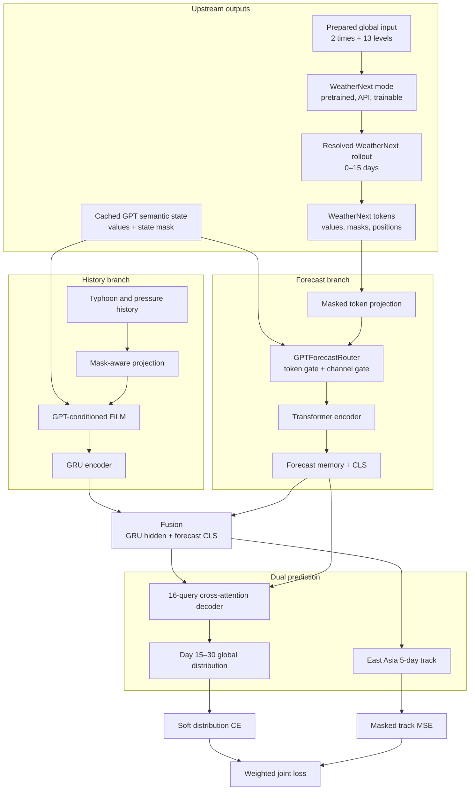

# Typhoon Forecasting System Diagrams

이 폴더는 `feature/weathernext-resolver`에 구현된 WeatherNext 2 + GPT semantic-state 태풍 장기예측 구조를 Mermaid로 정리합니다.

## Diagram index

| 문서 | 내용 |
|---|---|
| [01-overall-system.md](01-overall-system.md) | Resolver, offline inference, 두 encoder, 예측 head, loss까지 전체 구조 |
| [02-weathernext-transformer.md](02-weathernext-transformer.md) | WeatherNext token의 mask 순서, GPT Router, Transformer 입력 계약 |
| [03-gpt-dynamic-history.md](03-gpt-dynamic-history.md) | 하나의 GPT state가 History FiLM과 Forecast Router를 제어하는 두 경로 |
| [04-dual-loss-training.md](04-dual-loss-training.md) | 분포 CE와 동아시아 track MSE의 정확한 예측·gradient 경로 |
| [05-gpt-cache-runtime.md](05-gpt-cache-runtime.md) | API/cache 성공, 실패, 누락, 기능 비활성의 차이 |
| [06-gpt-forecast-router.md](06-gpt-forecast-router.md) | Router tensor shape, availability gate, identity 초기화와 학습 |

## Current architecture

## 구현 계약

| 항목 | 현재 구현 |
|---|---|
| History | 6시간 간격 8 step, 총 48시간 |
| WeatherNext input | HRES/ERA5 + supplements → 2×6-hour fields, 13 levels, global grid |
| WeatherNext mode | pretrained frozen / API frozen / explicitly trainable upstream |
| WeatherNext 학습 경계 | token cache에서 dual-loss autograd와 분리 |
| Forecast input | 0–15일, 최대 `10×6×12=720` token |
| Forecast masking | source feature mask → training random mask → effective token/padding mask |
| GPT state | Structured Output 10차원, 사전 cache |
| GPT 역할 | History FiLM + WeatherNext Token/Channel Router |
| GPT cache key 누락 | 학습 전 coverage 오류 |
| GPT masked record | FiLM과 Router 모두 exact identity |
| 분포 출력 | day 15–30, 16 query, `36×72=2592` global cells |
| 경로 출력 | 동아시아 `0–60°N, 100–180°E`, 6시간 간격 20 step |
| Loss | `λ_dist L_CE + λ_track L_MSE` |

## 중요한 구분

- “fine-tuned”는 checkpoint의 출처이고, 이 downstream model 안에서 WeatherNext를 다시 fine-tune한다는 뜻이 아닙니다.
- Channel Gate는 GPT context만 사용합니다. WeatherNext token과 GPT context를 함께 사용하는 것은 Token Gate입니다.
- History encoder는 packed/masked GRU가 아닙니다. 결측값과 mask를 처리한 projection 뒤에 standard GRU가 옵니다.
- `--gpt-state-dir`이 없으면 GPT adapter module 자체가 생성되지 않습니다. directory가 있으면 모든 token key의 cache 존재를 먼저 검사하고, 존재하지만 all-zero mask인 record만 identity로 동작합니다.
- 두 loss 모두 Router에 gradient를 전달합니다. 분포 loss는 forecast memory와 fusion query 경로를, track loss는 forecast CLS와 fusion 경로를 사용합니다.
