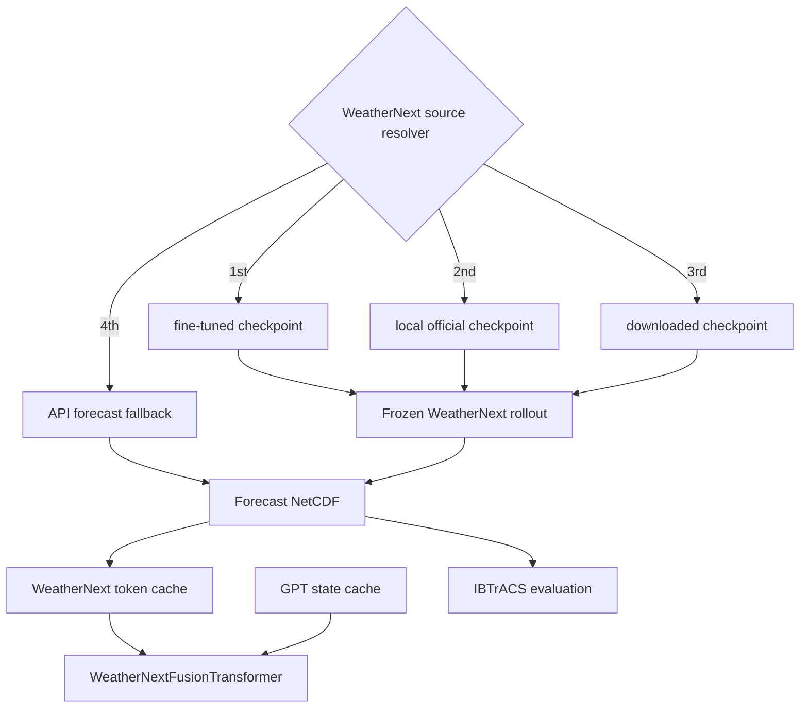

# WeatherNext 2 Backend Selection

이 프로젝트는 WeatherNext 2를 하나의 고정 실행 방식으로 가정하지 않습니다. 아래 세 backend 중 하나를 선택하고, 모든 결과를 동일한 `xarray.Dataset` 계약으로 변환합니다.



## Frozen source 선택 순서

`WeatherNextSelectionConfig` + `resolve_weathernext()`는 inference 경로에서 training을 시작하지 않습니다. 선택 순서는 고정되어 있습니다.

1. `finetuned_checkpoint`가 존재하면 해당 weight 사용
2. 없으면 `pretrained_checkpoint` 사용
3. 둘 다 없으면 downloader가 제공될 때 official checkpoint 다운로드/cache
4. 마지막으로 application에서 API client가 제공될 때 API forecast 사용

checkpoint 기반 runner는 `OfficialWeatherNextRunner`에서 read-only parameter로 실행되고 rollout 중 optimizer/gradient update가 없습니다.

```python
from typhoon_pressure import WeatherNextSelectionConfig, resolve_weathernext

selection = WeatherNextSelectionConfig(
    finetuned_checkpoint="checkpoints/korea_finetuned.npz",
    pretrained_checkpoint="download/weathernext/WeatherNext2/v0.3.0/checkpoint.npz",
    allow_download=True,
    allow_api_fallback=True,
)
resolved = resolve_weathernext(selection, downloader=my_downloader, api_client=my_api)
```

forecast provenance에는 `weathernext_weight_origin`이 추가되어 `finetuned`, `official`, `downloaded`, `api`를 구분합니다.

## 전체 WeatherNext → Weather-GPT pipeline

새 entry point는 다음 경계를 연결합니다.

```text
HRES/ERA5 + IBTrACS
        ↓
InitialConditionBuilder(history_steps=2)
        ↓
WeatherNext source resolver
        ↓
Frozen rollout
        ↓
data/weathernext_forecasts/*.nc
        ↓
WeatherNextForecastTokenizer
        ↓
data/weathernext_tokens/manifest.csv + *.npz
        ↓
WeatherNextFusionTransformer
```

Python API:

```python
from typhoon_pressure import (
    StormObservation,
    WeatherNextSelectionConfig,
    prepare_weathernext_sample,
)

result = prepare_weathernext_sample(
    atmospheric_state=hres_or_era5_history,
    storm=storm,
    selection=WeatherNextSelectionConfig(
        finetuned_checkpoint="checkpoints/korea_finetuned.npz",
        pretrained_checkpoint="download/weathernext2.npz",
    ),
)

print(result.resolved.origin)
print(result.forecast_path)
print(result.token_path)
```

CLI에서는 로컬 checkpoint 또는 public HTTPS checkpoint URL을 사용할 수 있습니다.

```bash
prepare-weathernext-pipeline \
  --atmospheric-state data/initial_state.nc \
  --storm-id TEST \
  --init-time 2025-08-01T00:00:00 \
  --lat 22.0 --lon 133.0 \
  --pressure-hpa 975 --wind-kt 70 \
  --finetuned-checkpoint checkpoints/korea_finetuned.npz \
  --pretrained-checkpoint download/weathernext2.npz \
  --checkpoint-url https://example.org/weathernext2.npz
```

`--checkpoint-url`은 local fine-tuned/pretrained checkpoint가 없을 때만 사용됩니다. 파일은 기본적으로 `download/weathernext/<model>/<release>/`에 cache됩니다. 인증이 필요한 Google Cloud/사설 저장소는 provider별 downloader를 application에서 `resolve_weathernext(..., downloader=...)`로 주입해야 합니다.

## GPT state와 후단 학습

WeatherNext token cache가 생성되면 기존 GPT state cache 및 Fusion training을 그대로 사용합니다.

```bash
build-gpt-state-cache \
  --integrated data/integrated.parquet \
  --output-dir data/gpt_states

train-weathernext-transformer \
  --integrated data/integrated.parquet \
  --distribution data/spatial_distribution.csv \
  --weathernext-token-dir data/weathernext_tokens \
  --gpt-state-dir data/gpt_states \
  --output checkpoints/weathernext_transformer.pt
```

이 구조에서 WeatherNext weight는 frozen이고 `WeatherNextFusionTransformer`만 optimizer에 포함됩니다. 따라서 WeatherNext를 fine-tune한 경우에도 그 결과 checkpoint를 inference source로 사용한 뒤 후단 fusion weight를 별도로 학습합니다.

## Direct training / fine-tuning 경로

WeatherNext 자체를 다시 학습하고 싶을 때만 기존 `trainable` backend를 명시적으로 사용합니다.

```python
config = WeatherNextBackendConfig(
    backend="trainable",
    model_id="WeatherNext2_custom",
    release="v0.3.0",
    training_kwargs={"epochs": 10},
)
runner = build_weathernext_runner(
    config,
    trainable_model=my_trainable_wn2,
    training_data=train_dataset,
)
runner.fit()
```

fine-tuning 결과 checkpoint가 만들어지면 다음 inference 실행부터 `finetuned_checkpoint` 위치에 지정하면 resolver가 가장 먼저 선택합니다.

## WeatherNext 입력 계약

공식 WN2의 12시간 input 계약을 충족하려면 6시간 간격의 대기장 두 개를 초기조건에 보존해야 합니다.

```python
builder = InitialConditionBuilder(mode="auto", history_steps=2)
condition = builder.build(hres_or_era5_history, storm)
```

전체 WN2 입력 변수, 해당 model configuration의 pressure levels, 전 지구 격자가 필요합니다. 지역 fine-tuning weight를 사용하더라도 official WeatherNext input contract 자체는 유지해야 합니다.

## API fallback

API forecast는 checkpoint weight 다운로드와 다릅니다. API backend는 remote forecast 결과를 `xarray.Dataset`으로 반환하는 경로입니다. provider별 인증/endpoint 차이 때문에 CLI에는 특정 API를 하드코딩하지 않았고 application에서 client를 주입합니다.

```python
resolved = resolve_weathernext(
    selection,
    downloader=my_downloader,
    api_client=my_weather_client,
)
```

client contract:

```text
forecast(initial_state, horizon_hours, model_id=...) -> xarray.Dataset
```

## Evaluation provenance

forecast에는 가능한 경우 다음 provenance가 기록됩니다.

```text
weathernext_backend
weathernext_model_id
weathernext_release
weathernext_checkpoint
weathernext_api_provider
weathernext_weight_origin
weathernext_resolved_checkpoint
```

이를 통해 동일 IBTrACS ground truth에 대해 fine-tuned / official / downloaded / API source를 분리 평가할 수 있습니다.

## 설치

```bash
pip install -e '.[weathernext]'
```

GPU에서는 실행 환경에 맞는 JAX CUDA wheel이 별도로 필요할 수 있습니다.

## 공식 자료

- Google DeepMind WeatherNext repository
- WeatherNext 2 demo notebook
- Google Cloud WeatherNext access documentation
