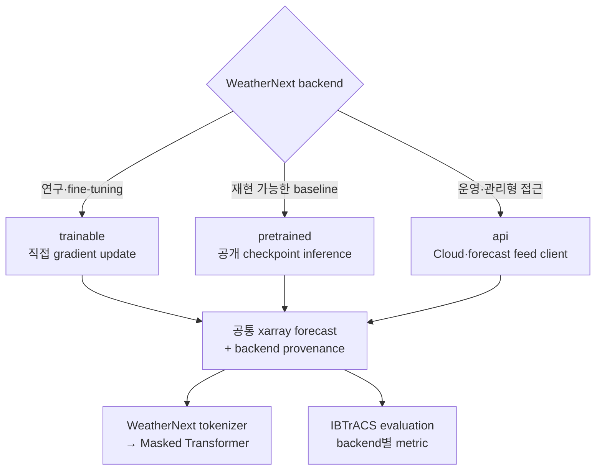

# WeatherNext 2 Backend Selection

이 프로젝트는 WeatherNext 2를 하나의 고정 실행 방식으로 가정하지 않습니다. 아래 세 backend 중 하나를 선택하고, 모든 결과를 동일한 `xarray.Dataset` 계약으로 변환합니다.



## 선택 기준

| backend | 사용 시점 | 필수 입력 | 장점 | 주의점 |
|---|---|---|---|---|
| `trainable` | 구조 변경, fine-tuning, gradient 실험 | trainable model, training data | 가중치 변경 가능 | 높은 계산량, 명시적 `fit()` 필요 |
| `pretrained` | 표준 baseline, 빠른 연구 시작 | 초기화된 모델, release, checkpoint | 재현성과 비교 용이 | checkpoint와 초기조건 계약 고정 필요 |
| `api` | 운영 시스템, 관리형 Cloud·data feed | API client, provider 이름 | 로컬 대형 가속기 불필요 | 권한·비용·응답 schema 관리 필요 |

Google의 공식 저장소는 WN2 코드와 pretrained weights 실행을 제공하고, forecast data feed는 Google Cloud, WeatherLab, Open-Meteo 등으로 제공합니다. research code의 API 안정성은 보장되지 않으므로 release를 고정해야 합니다.

## 공통 configuration

```python
from typhoon_pressure.weathernext_backends import (
    WeatherNextBackendConfig,
    build_weathernext_runner,
)
```

### 1. Direct training 또는 fine-tuning

```python
config = WeatherNextBackendConfig(
    backend="trainable",
    model_id="WeatherNext2_custom",
    release="v0.3.0",
    training_kwargs={"epochs": 10},
)
runner = build_weathernext_runner(
    config,
    trainable_model=my_trainable_wn2,
    training_data=train_dataset,
)
runner.fit()
forecast = run_weathernext(runner, request)
```

`fit()`은 자동으로 실행하지 않습니다. 대규모 학습이 inference 과정에서 우발적으로 시작되는 것을 방지하기 위함입니다.

### 2. Pretrained checkpoint

```python
config = WeatherNextBackendConfig(
    backend="pretrained",
    model_id="WeatherNext2_finetuned_35N45N",
    model_variant="WeatherNext2",
    release="v0.3.0",
    checkpoint="/weights/weather-me-fine_tune_weight.npz",
)
runner = build_weathernext_runner(config)
forecast = run_weathernext(runner, request)
```

`build_weathernext_runner()`는 checkpoint를 공식 `fgn.CheckPoint`로 읽고
`OfficialWeatherNextRunner`를 자동 생성합니다. 이 경로에는 `fit()`, optimizer,
gradient update가 없으므로 rollout 중 추가 학습이 일어나지 않습니다. 파인튜닝된
파라미터는 읽기 전용으로 유지되며 그대로 추론에 사용됩니다.

파인튜닝 저장소에서 함께 생성한
`weather-me-fine_tune_weight.metadata.json`을 가중치 옆에 두면 model 종류와
release를 자동 검증합니다.

```text
/weights/
├── weather-me-fine_tune_weight.npz
└── weather-me-fine_tune_weight.metadata.json
```

지원되는 model variant와 alias는 다음과 같습니다.

| `model_variant` | alias | 해상도 | 호환 가중치 |
|---|---|---:|---|
| `WeatherNext2` | `weather-next`, `weather-next2` | 0.25° | WeatherNext2에서 파인튜닝한 weight |
| `WeatherNextCyclones` | `cyclone`, `cyclones` | 0.25° | WeatherNextCyclones weight |
| `WeatherNextCyclones_Mini` | `mini`, `weather-next-mini` | 1.0° | Mini weight |

서로 다른 모델의 가중치는 교환할 수 없습니다. 예를 들어 Mini에서 만든 weight를
0.25° WeatherNext2 config에 로드하면 안 됩니다. GraphCast와 GenCast도 checkpoint
구조가 다르므로 이 WN2 fine-tuned weight의 대상이 아닙니다.

공식 WN2의 12시간 input 계약을 충족하려면 6시간 간격의 대기장 두 개를
초기조건에 보존해야 합니다.

```python
builder = InitialConditionBuilder(
    mode="auto",
    history_steps=2,
)
condition = builder.build(hres_or_era5_history, storm)
request = make_weathernext_request(condition, horizon_hours=360)
```

전체 WN2 입력 변수, 13개 pressure level, 전 지구 격자가 필요합니다. 35–45°N에
대해 파인튜닝한 weight도 입력은 전 지구로 유지합니다. 운영 pretrained WN2는
HRES 초기조건에 맞춰져 있으므로 ERA5를 사용할 때는 별도 검증이 필요합니다.

설치:

```bash
pip install -e '.[weathernext]'
```

GPU에서는 실행 환경에 맞는 JAX CUDA wheel을 별도로 설치해야 합니다. 첫 rollout은
JAX compile 때문에 오래 걸릴 수 있습니다.

### 공식 weight 다운로드와 적용 검증

```bash
download-weathernext-checkpoint --model weathernext2
```

기본 저장 위치는 `download/`이며, checkpoint와 함께
`checkpoint_kind=official_pretrained` metadata를 생성합니다. 이후
`prepare-weathernext-tokens`로 rollout과 token cache를 만들면 해당 종류·모델·release·
checkpoint 경로가 `manifest.csv`에 기록됩니다.

후단 학습에서는 다음 옵션으로 입력 출처를 강제할 수 있습니다.

```bash
# 공식 pretrained 출력만 허용
train-weathernext-transformer ... \
  --require-checkpoint-kind official_pretrained

# weather-me-fine_tune_weight 출력만 허용
train-weathernext-transformer ... \
  --require-checkpoint-kind fine_tuned
```

최종 PyTorch checkpoint에도 `weathernext_provenance`가 저장되므로, 학습이 공식
pretrained 출력과 fine-tuned 출력 중 어느 쪽을 사용했는지 사후 확인할 수 있습니다.
자세한 실행 순서는 [`../download/README.md`](../download/README.md)를 참고하십시오.

### 3. API 또는 managed forecast feed

```python
config = WeatherNextBackendConfig(
    backend="api",
    model_id="WeatherNext2_<2025",
    release="v0.3.0",
    api_provider="vertex-ai",
)
runner = build_weathernext_runner(config, api_client=my_weather_client)
forecast = run_weathernext(runner, request)
```

공식 서비스마다 호출 규격이 다르므로 이 저장소는 특정 HTTP endpoint를 하드코딩하지 않습니다. client는 `forecast(initial_state, horizon_hours, model_id=...) -> xarray.Dataset` 계약만 구현합니다.

## Evaluation provenance

모든 backend 출력에는 다음 attribute가 기록됩니다.

```text
weathernext_backend
weathernext_model_id
weathernext_release
weathernext_checkpoint
weathernext_api_provider
```

예측 CSV에 `weathernext_backend`를 유지하면 IBTrACS evaluation이 `metrics_by_backend.csv`를 생성합니다.

## 공식 자료

- [Google DeepMind WeatherNext repository](https://github.com/google-deepmind/weathernext)
- [WeatherNext 2 demo notebook](https://github.com/google-deepmind/weathernext/blob/main/docs/weathernext2/wn2_demo.ipynb)
- [Google Cloud WeatherNext access](https://cloud.google.com/blog/topics/hpc/powering-scientific-discovery-with-google-cloud)
