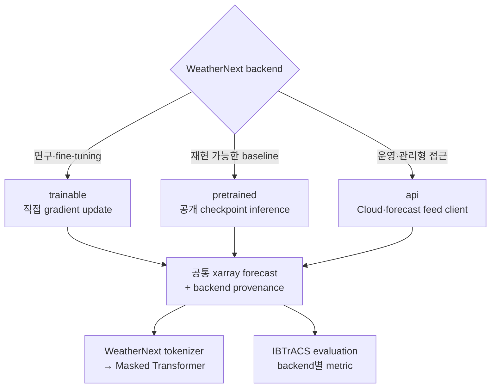

# WeatherNext 2 Backend Selection

이 프로젝트는 WeatherNext 2를 하나의 고정 실행 방식으로 가정하지 않습니다. 아래 세 backend 중 하나를 선택하고, 모든 결과를 동일한 `xarray.Dataset` 계약으로 변환합니다.



## 선택 기준

| backend | 사용 시점 | 필수 입력 | 장점 | 주의점 |
|---|---|---|---|---|
| `trainable` | 구조 변경, fine-tuning, gradient 실험 | trainable model, training data | 가중치 변경 가능 | 높은 계산량, 명시적 `fit()` 필요 |
| `pretrained` | 표준 baseline, 빠른 연구 시작 | 초기화된 모델, release, checkpoint | 재현성과 비교 용이 | checkpoint와 초기조건 계약 고정 필요 |
| `api` | 운영 시스템, 관리형 Cloud·data feed | API client, provider 이름 | 로컬 대형 가속기 불필요 | 권한·비용·응답 schema 관리 필요 |

Google의 공식 저장소는 WN2 코드와 pretrained weights 실행을 제공하고, forecast data feed는 Google Cloud, WeatherLab, Open-Meteo 등으로 제공합니다. research code의 API 안정성은 보장되지 않으므로 release를 고정해야 합니다.

## 공통 configuration

```python
from typhoon_pressure.weathernext_backends import (
    WeatherNextBackendConfig,
    build_weathernext_runner,
)
```

### 1. Direct training 또는 fine-tuning

```python
config = WeatherNextBackendConfig(
    backend="trainable",
    model_id="WeatherNext2_custom",
    release="v0.3.0",
    training_kwargs={"epochs": 10},
)
runner = build_weathernext_runner(
    config,
    trainable_model=my_trainable_wn2,
    training_data=train_dataset,
)
runner.fit()
forecast = run_weathernext(runner, request)
```

`fit()`은 자동으로 실행하지 않습니다. 대규모 학습이 inference 과정에서 우발적으로 시작되는 것을 방지하기 위함입니다.

### 2. Pretrained checkpoint

```python
config = WeatherNextBackendConfig(
    backend="pretrained",
    model_id="WeatherNext2_<2025",
    release="v0.3.0",
    checkpoint="WeatherNext2_<2025_model1.npz",
)
runner = build_weathernext_runner(config, pretrained_model=loaded_wn2)
forecast = run_weathernext(runner, request)
```

운영 pretrained WN2는 HRES 초기조건에 맞춰져 있으므로 ERA5를 사용할 때는 별도 검증이 필요합니다.

### 3. API 또는 managed forecast feed

```python
config = WeatherNextBackendConfig(
    backend="api",
    model_id="WeatherNext2_<2025",
    release="v0.3.0",
    api_provider="vertex-ai",
)
runner = build_weathernext_runner(config, api_client=my_weather_client)
forecast = run_weathernext(runner, request)
```

공식 서비스마다 호출 규격이 다르므로 이 저장소는 특정 HTTP endpoint를 하드코딩하지 않습니다. client는 `forecast(initial_state, horizon_hours, model_id=...) -> xarray.Dataset` 계약만 구현합니다.

## Evaluation provenance

모든 backend 출력에는 다음 attribute가 기록됩니다.

```text
weathernext_backend
weathernext_model_id
weathernext_release
weathernext_checkpoint
weathernext_api_provider
```

예측 CSV에 `weathernext_backend`를 유지하면 IBTrACS evaluation이 `metrics_by_backend.csv`를 생성합니다.

## 공식 자료

- [Google DeepMind WeatherNext repository](https://github.com/google-deepmind/weathernext)
- [WeatherNext 2 demo notebook](https://github.com/google-deepmind/weathernext/blob/main/docs/weathernext2/wn2_demo.ipynb)
- [Google Cloud WeatherNext access](https://cloud.google.com/blog/topics/hpc/powering-scientific-discovery-with-google-cloud)
